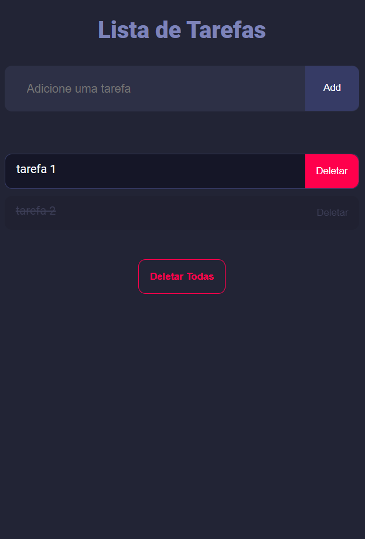
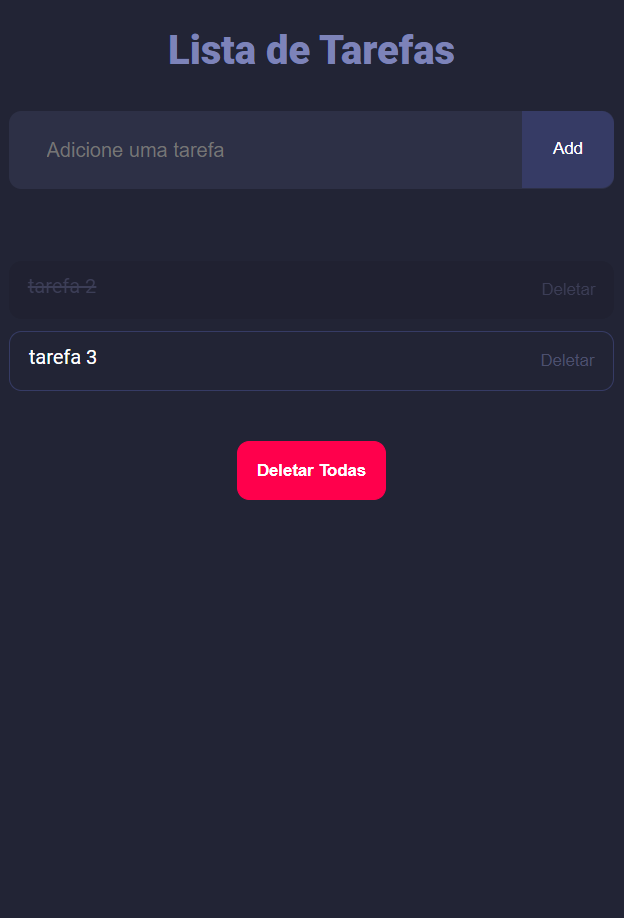

# Lista de Tarefas

Este é um projeto de lista de tarefas desenvolvido utilizando [ReactJS](https://github.com/facebook/react), [Node.js](https://github.com/nodejs/node) e [Vite](https://github.com/vitejs/vite).

## Telas

Aqui estão algumas capturas de tela do projeto:

  

## Tutorial

Se você quiser reproduzir esse projeto, você pode seguir o [Curso de React Para Iniciantes - Programação Web](https://www.youtube.com/watch?v=hd2B7XQAFls&list=PL2Fdisxwzt_c4dlgeANTt8npMM9T5-ATk) disponível no YouTube.

Sinta-se à vontade para explorar e utilizar este projeto para criar sua própria lista de tarefas com React!
